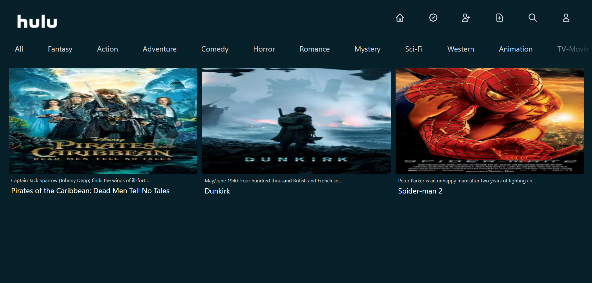
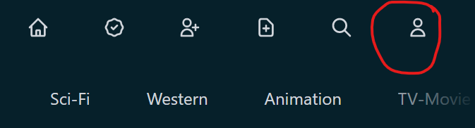
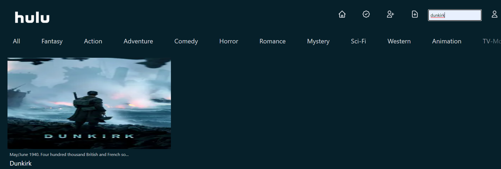
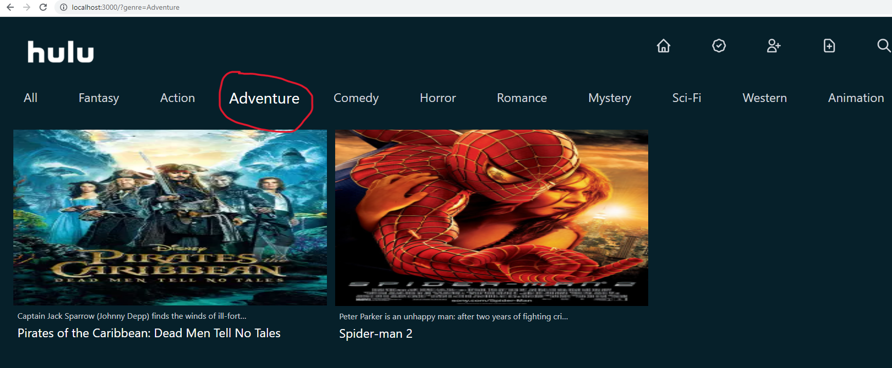
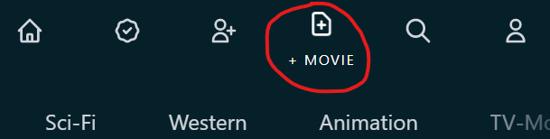
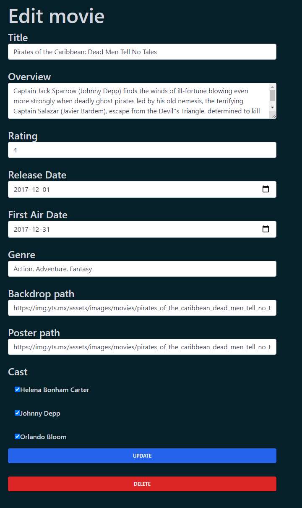
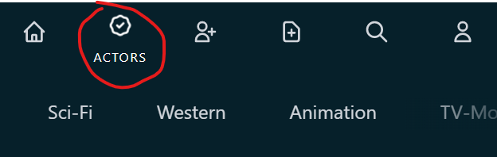
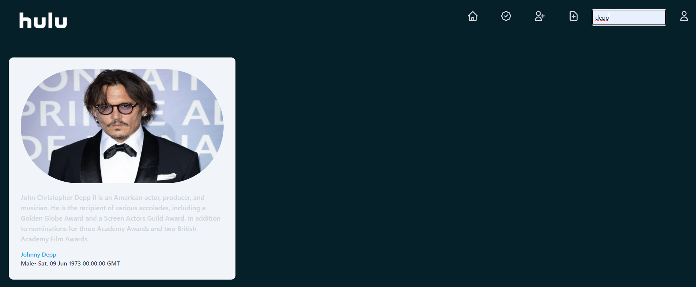
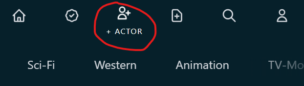
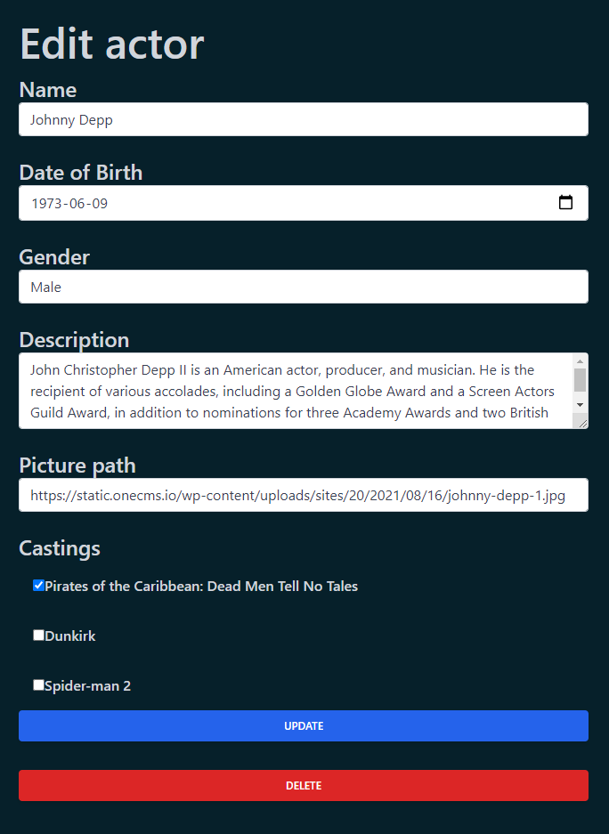

# Udacity Full stack Nanodegree Capstone Project

This is a [Next.js](https://nextjs.org/) project bootstrapped with [`create-next-app`](https://github.com/vercel/next.js/tree/canary/packages/create-next-app) and hosted on Heroku with a Flask and Postgres backend. The front end is styled with Tailwind and the backend authentication is handled by an external Auth0 service. It is hosted live [here](https://movies-frontend-ui.herokuapp.com/). The live backend api is hosted live [here](https://movies-backend-api.herokuapp.com/)

I hosted the front end and backend separately as there was no way to host a Flask backend and server side rendered front end in Next on the same app. However, the backend and front end folders of this project contain the source code for both builds.

## App Description

This app is a Hulu clone with a twist: it is used by movie makers to plan movies in advance. It is used to view, edit, create and delete actors and movies.


 An authenticated user can be either a casting agent, casting director or executive producer, each with increasing levels of permissions. An unauthenticated user can still view all movies and actors but to see more details by clicking on it you have to sign in.

 ### App credentials
 To test the different levels of RBAC for this app, I have created 3 different log in credentials corresponding to the 3 different roles for ease of testing:

 *Casting agent*: email: likasi8727@mxclip.com password: CastingAgent_1
 
 *Casting director:* email: likasi8737@mxclip.com password: CastingDirector_1

 *Executive producer:* email: likasi8747@mxclip.com password: ExecutiveProducer_1

# Account

You can sign-in/sign-out by clicking on the account icon:
  Which will then take you to the log in/log out page for authentication and authorization using Auth0.

# Movies

 The home page of the app also serves as the movies page where you can see all the movies currently listed on the app. Each movie has a title, genres, description, ratings and so on.

 You can filter the movies by searching by title using the search tab: 

 or using the genres bar to filter movies matching the selected genre: 

## Adding
 To add movies, you have to have at least executive producer permissions. If you have such permissions, you will see the new movie icon:   Click that and you can then fill in the movie details and submit the form and you should see your movie added to the movies page.

 ## View
 To view each movie in more detail, you have to have at least casting agent permissions. If you have such permissions, you should be able to click on each movie to view its full details.

 ## Edit
 To edit an existing movie, you have to have at least casting director permissions. If you have such permissions, you should be able to click on each movie to view its full details and edit it. The cast list shows which actors acted in the movie and can be updated. Adding or removing an actor to the movie updates that actor's page's movies.

 ## Delete
 To delete an existing movie, you have to have at least executive producer permissions. If you have such permissions, you should be able to click on each movie to view its full details, update and delete it. It should have both update and delete buttons.

# Actors

 To view all actors, you just need to click the actors icon. You don't need to be signed in to do this: 

 You can filter the actors by searching by name using the search tab:
 

 ## Adding
 To add actors, you have to have at least casting director permissions. If you have such permissions, you will see the new actor icon:   Click that and you can then fill in the actor details and submit the form and you should see the actor added to the actors page.

 ## View
 To view each actor in more detail, you have to have at least casting agent permissions. If you have such permissions, you should be able to click on each actor to view its full details.

 ## Edit
 To edit an existing actor, you have to have at least casting director permissions. If you have such permissions, you should be able to click on each actor to view its full details and edit it. The castings list shows which movies the actor has acted in and can be updated Adding or removing a movie updates the actors list on that movies page.

 ## Delete
 To delete an existing actor, you have to have at least executive producer permissions. If you have such permissions, you should be able to click on each movie to view its full details, update and delete it. It should have both update and delete buttons.


## Modifying the code

### Front end
To work on the front-end, from the frontend folder, run:

```bash
npm i
npm run dev
```

Open [http://localhost:3000](http://localhost:3000) with your browser to see the result.

### Back end
To work on the back end, follow the following steps:
1. **Python 3.9** - Follow instructions to install the latest version of python for your platform in the [python docs](https://docs.python.org/3/using/unix.html#getting-and-installing-the-latest-version-of-python)


2. **Virtual Enviornment** - We recommend working within a virtual environment whenever using Python for projects. This keeps your dependencies for each project separate and organaized. Instructions for setting up a virual enviornment for your platform can be found in the [python docs](https://packaging.python.org/guides/installing-using-pip-and-virtual-environments/)


3. **PIP Dependencies** - Once you have your virtual environment setup and running, install dependencies by naviging to the `/backend` directory and running:
```bash
pip install -r requirements.txt
```
This will install all of the required packages we selected within the `requirements.txt` file.

4. **Database setup** - To set up the database url as an environment variable, run:
```bash
source setup.sh
``` 
With Postgres running, create and populate the movie_site and movie_site_test databases using the setup.sql file provided. These would be our actual and test databases respectively. From the backend folder in terminal, in psql context, run:
```bash
\i db_setup.sql
```
5. **Run the app** - To run the app, from the backend folder, run:
```bash
python app.py
```

6. **Test the app** - To test the app, run the movie site postman collection ini the backend folder. You can also run the unit tests in test.py. 